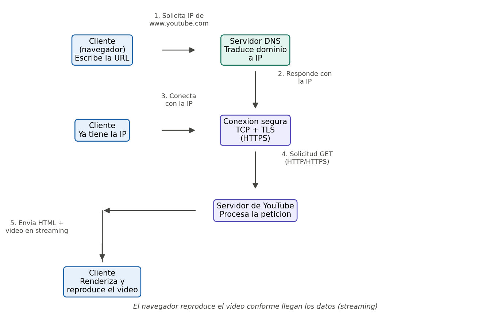

# Fundamentos de Internet

## 1. Del Cliente al Servidor

Cuando escribimos `www.youtube.com` en el navegador y presionamos Enter, ocurre una secuencia de pasos hasta que el video aparece en pantalla:

**1. El cliente (navegador) inicia la solicitud**
El navegador interpreta la URL: identifica el protocolo (`https://`), el dominio (`www.youtube.com`) y el recurso solicitado. Antes de poder contactar al servidor necesita traducir ese nombre de dominio a una dirección IP, porque en la red los dispositivos se identifican por IP, no por nombres.

**2. El DNS traduce el dominio a una IP**
El DNS (Domain Name System) funciona como una "guía telefónica" de Internet. El proceso típico es:
- El navegador consulta primero su propia caché (¿ya visitó este sitio antes?).
- Si no la tiene, pregunta al servidor DNS configurado en la red (usualmente el del proveedor de Internet).
- Ese servidor, si no tiene la respuesta guardada, consulta en cascada a servidores raíz → servidores del dominio `.com` → servidores autoritativos de Google/YouTube, hasta obtener la IP correcta.
- La IP resultante se devuelve al navegador y se guarda en caché para futuras consultas.

**3. Se resuelve la dirección IP y se conecta al servidor**
Con la IP en mano, el navegador establece una conexión con el servidor real que aloja el contenido, normalmente mediante TCP. Si es HTTPS, además se realiza un "handshake" TLS para cifrar la comunicación.

**4. Entra en juego el protocolo HTTP/HTTPS**
El navegador envía una solicitud HTTP/HTTPS (una petición `GET`) pidiendo el recurso: la página del video, sus metadatos, miniaturas, etc. HTTPS es la versión cifrada de HTTP, así que toda la comunicación viaja protegida.

**5. El servidor responde**
El servidor de YouTube recibe la solicitud, la procesa (busca el video, verifica permisos, prepara el streaming) y responde enviando el código HTML/CSS/JS de la página y luego el flujo de video en paquetes, normalmente desde servidores CDN geográficamente cercanos al usuario para reducir la latencia.

**6. El navegador renderiza el contenido**
El navegador recibe los datos, arma la interfaz y reproduce el video conforme van llegando los paquetes (streaming).



En resumen: el **DNS** traduce el nombre a una **IP**, esa IP permite establecer la conexión, y **HTTP/HTTPS** es el idioma en el que cliente y servidor conversan (qué se pide, qué se responde, y con HTTPS, todo cifrado).

## 2. Frontend y Backend en acción

Para una app web de agendamiento de citas médicas:

**Frontend**
Es la parte con la que interactúa el paciente: formularios para elegir especialidad y horario, calendario de disponibilidad, notificaciones de confirmación, vista del historial de citas. Corre en el navegador o en la app móvil del usuario.

Tecnologías posibles: **React**, **Vue.js**, **Angular** (o **Flutter**/**React Native** si es una app móvil).

**Backend**
Es la parte que corre en el servidor: valida que el horario esté disponible, guarda la cita en la base de datos, aplica reglas de negocio (por ejemplo, que un médico no tenga dos citas al mismo tiempo), maneja la autenticación de usuarios y envía notificaciones.

Tecnologías posibles: **Node.js con Express**, **Django (Python)**, **Spring Boot (Java)**.

**Comunicación frontend-backend**
El frontend se comunica con el backend a través de una **API**: cuando el paciente confirma una cita, el frontend arma una **solicitud HTTP** (por ejemplo `POST /citas` con los datos en formato JSON) y la envía al backend. El backend procesa esa **request**, valida los datos, los guarda y devuelve una **response** (por ejemplo un código `201 Created` con la información de la cita creada, o un `400` si el horario ya estaba ocupado). Este ciclo de solicitud/respuesta es el que permite que la interfaz visual y la lógica de negocio/datos, aunque corran en lugares distintos, funcionen como una sola aplicación.

## 3. REST vs SOAP vs GraphQL

| Tipo de API | Formato de datos usado | Nivel de flexibilidad | Dificultad de implementación | Uso actual (Alta / Media / Baja) |
|-------------|------------------------|------------------------|-------------------------------|-----------------------------------|
| REST | JSON (también XML) | Media-Alta: el cliente consume endpoints fijos, pero es sencillo de extender y versionar | Baja-Media | Alta |
| SOAP | XML (estricto, con esquema WSDL) | Baja: contrato rígido definido por el servidor, poco margen para el cliente | Alta | Baja (se mantiene en sistemas legacy, banca, salud) |
| GraphQL | JSON | Alta: el cliente decide exactamente qué campos necesita en una sola consulta | Media-Alta (requiere definir un esquema y resolvers) | Media (creciendo, usado por empresas grandes) |

**¿Cuál es más apropiada para una startup moderna que desarrolla un sistema de reservas en línea? ¿Por qué?**

Para una startup que recién arranca, **REST** suele ser la opción más apropiada: tiene una curva de aprendizaje baja, un ecosistema enorme de herramientas (documentación, testing, caching a nivel de HTTP), y es fácil de construir e iterar rápido con un equipo pequeño. SOAP resulta excesivo para este caso: fue pensado para entornos empresariales con contratos muy estrictos y agrega complejidad innecesaria. GraphQL es una alternativa interesante si la app crece y distintas pantallas necesitan combinaciones muy variadas de datos (evitando over-fetching/under-fetching), pero implica más esfuerzo inicial de diseño del esquema; suele adoptarse más adelante, cuando el producto y el equipo ya maduraron.

## 4. Explorando APIs con Postman

### 4.1 Selección de la API

- **Nombre de la API:** JSONPlaceholder
- **Descripción:** API REST gratuita y sin autenticación pensada para pruebas y prototipos. Simula un backend completo con recursos típicos (`posts`, `comments`, `albums`, `photos`, `todos`, `users`) y responde a operaciones `GET`, `POST`, `PUT`, `PATCH` y `DELETE` como lo haría una API real, aunque los cambios no se persisten de verdad en el servidor.

### 4.2 Configuración en Postman

- **Nombre de la colección:** `JSONPlaceholder - Fundamentos de Internet`
- **Solicitudes agregadas:**
  - GET → `GET {{baseUrl}}/posts/1` (obtener el detalle de un post)
  - POST → `POST {{baseUrl}}/posts` (crear un nuevo post)
  - PUT → `PUT {{baseUrl}}/posts/1` (actualizar un post existente)
  - DELETE → `DELETE {{baseUrl}}/posts/1` (eliminar un post)
- Se configuró la variable de entorno `baseUrl` con el valor `https://jsonplaceholder.typicode.com`, ya que la API no requiere token ni autenticación.

### 4.3 Ejecución y análisis

| Solicitud | Método | Endpoint | Código de estado | Notas |
|-----------|--------|----------|-------------------|-------|
| Obtener post | GET | `/posts/1` | 200 OK | Devuelve el objeto JSON del post con id 1 |
| Crear post | POST | `/posts` | 201 Created | Devuelve el objeto enviado con un nuevo `id` asignado |
| Actualizar post | PUT | `/posts/1` | 200 OK | Devuelve el objeto actualizado con los campos enviados |
| Eliminar post | DELETE | `/posts/1` | 200 OK | Devuelve un objeto vacío `{}` como confirmación |

Header relevante en todas las respuestas: `Content-Type: application/json; charset=utf-8`.

### 4.4 Explicación técnica

#### Obtener post (GET)
- **Método HTTP:** `GET`
- **Endpoint:** `/posts/1`
- **Parámetros / body:** ninguno
- **Descripción de la respuesta:** devuelve un único objeto JSON con los datos del post solicitado (id, título, cuerpo y el id del usuario autor).

```json
{
  "userId": 1,
  "id": 1,
  "title": "sunt aut facere repellat provident occaecati excepturi optio reprehenderit",
  "body": "quia et suscipit\nsuscipit recusandae consequuntur expedita et cum\nreprehenderit molestiae ut ut quas totam\nnostrum rerum est autem sunt rem eveniet architecto"
}
```

#### Crear post (POST)
- **Método HTTP:** `POST`
- **Endpoint:** `/posts`
- **Parámetros / body:**
```json
{
  "title": "Fundamentos de Internet",
  "body": "Practicando solicitudes HTTP con Postman",
  "userId": 1
}
```
- **Descripción de la respuesta:** la API responde con el mismo objeto enviado, agregando un nuevo `id` (simulado, no se guarda realmente en el servidor).

```json
{
  "title": "Fundamentos de Internet",
  "body": "Practicando solicitudes HTTP con Postman",
  "userId": 1,
  "id": 101
}
```

#### Actualizar post (PUT)
- **Método HTTP:** `PUT`
- **Endpoint:** `/posts/1`
- **Parámetros / body:**
```json
{
  "id": 1,
  "title": "Fundamentos de Internet (actualizado)",
  "body": "Contenido actualizado desde Postman",
  "userId": 1
}
```
- **Descripción de la respuesta:** devuelve el objeto con los campos reemplazados por los enviados.

```json
{
  "id": 1,
  "title": "Fundamentos de Internet (actualizado)",
  "body": "Contenido actualizado desde Postman",
  "userId": 1
}
```

#### Eliminar post (DELETE)
- **Método HTTP:** `DELETE`
- **Endpoint:** `/posts/1`
- **Parámetros / body:** ninguno
- **Descripción de la respuesta:** objeto vacío `{}`, confirmando que el recurso fue "eliminado".

**¿Qué aprendiste del proceso?**
Se reforzó de forma práctica cómo cada verbo HTTP (`GET`, `POST`, `PUT`, `DELETE`) corresponde a una operación distinta sobre un mismo recurso, y cómo el código de estado de la respuesta (200, 201, etc.) comunica de inmediato si la operación fue exitosa, sin necesidad de leer todo el cuerpo de la respuesta.

### 4.5 Reflexión final

Este ejercicio ayudó a entender de forma concreta que una API no es más que un conjunto de reglas y endpoints que exponen operaciones sobre un recurso, y que cada solicitud HTTP lleva implícita una intención (leer, crear, actualizar o eliminar) que el servidor interpreta según el método y la ruta usados.

Postman fue clave para visualizar ese ciclo cliente-servidor que normalmente queda oculto detrás de una interfaz web: permitió armar manualmente cada solicitud, ver exactamente qué se envía (headers, body) y qué responde el servidor (status code, headers, JSON), lo que hace mucho más tangible el concepto de "request/response" que suele explicarse solo en teoría.
